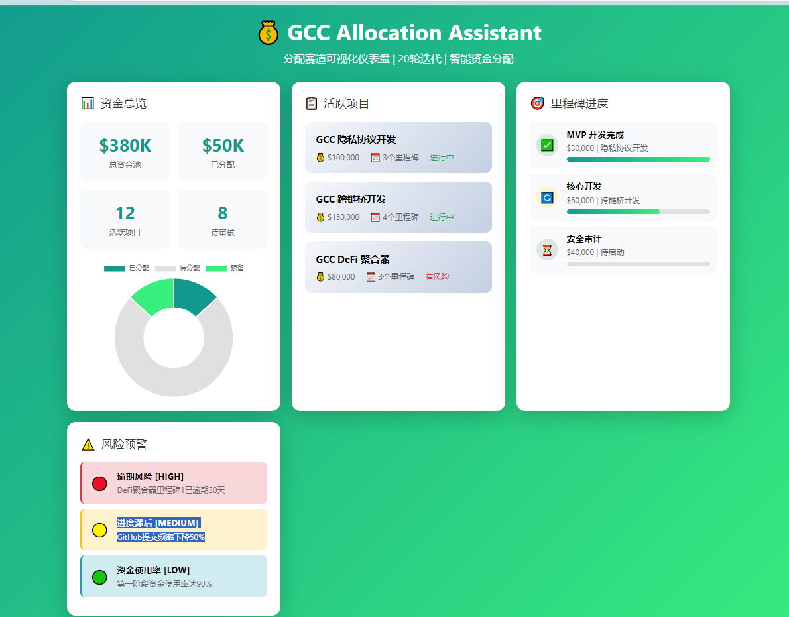

# 排障指南：升级 Copilot Pro 后 VS Code 仍无法使用

> **Troubleshooting Guide: Copilot Pro Upgraded but Still Unavailable in VS Code**  
> 本文档以中文为主，文末附英文简要版本。  
> This document is primarily in Chinese, with a brief English summary at the end.

---

## 目录

1. [问题现象](#1-问题现象)
2. [检查 GitHub 账号登录一致性](#2-检查-github-账号登录一致性)
3. [确认订阅是否生效及组织策略](#3-确认订阅是否生效及组织策略)
4. [检查 VS Code 扩展版本与启用状态](#4-检查-vs-code-扩展版本与启用状态)
5. [重启、重新登录、清缓存与重装扩展](#5-重启重新登录清缓存与重装扩展)
6. [网络、代理与地区可用性](#6-网络代理与地区可用性)
7. [高级模型的额外要求与"Auto"含义](#7-高级模型的额外要求与-auto-含义)
8. [收集与导出 Copilot 诊断日志](#8-收集与导出-copilot-诊断日志)
9. [截图说明与引导](#9-截图说明与引导)
10. [仍未解决？联系支持](#10-仍未解决联系支持)
11. [English Quick Reference](#11-english-quick-reference)

---

## 1. 问题现象

用户升级 GitHub Copilot Pro 后，在 VS Code 的模型选择列表中，**部分模型旁仍显示"升级"（Upgrade）标注**，或 Copilot 功能整体不可用。

典型截图示例（示意）：

```
模型选择列表
  ● GPT-4o          ✓ 可用
  ● Claude 3.5      🔒 升级
  ● o1-preview      🔒 升级
  ● Auto            ✓ 可用
```

> **截图含义说明：**  
> - ✓ 可用：当前订阅已包含该模型，可直接使用。  
> - 🔒 升级：该模型需要更高级别的订阅（如 Copilot Pro+）或额外权限，**并非表示 Pro 订阅未生效**。  
> - 如果**所有模型**均显示"升级"，则通常是订阅未生效或账号问题。

---

## 2. 检查 GitHub 账号登录一致性

**最常见原因：VS Code 登录的 GitHub 账号与购买 Copilot Pro 的账号不一致。**

### 检查步骤

1. **确认网页端订阅账号**  
   打开 [https://github.com/settings/copilot](https://github.com/settings/copilot)，查看：
   - 右上角头像对应的用户名
   - Copilot 订阅状态（应显示 **Active** 或 **Pro**）

2. **确认 VS Code 登录账号**  
   - 点击 VS Code 左下角账号图标（或 `Ctrl+Shift+P` → 输入 `GitHub: Sign In`）
   - 查看已登录的 GitHub 账号用户名

3. **对比两个账号是否一致**  
   - ✅ 一致：继续下一步排查
   - ❌ 不一致：在 VS Code 中**退出当前账号**，重新用购买了 Copilot Pro 的账号登录

### 操作：切换账号

```
VS Code → 左下角账号图标 → "Sign Out" → 重新 "Sign in with GitHub"
```

---

## 3. 确认订阅是否生效及组织策略

### 3.1 个人订阅检查

1. 访问 [https://github.com/settings/billing/summary](https://github.com/settings/billing/summary)
2. 确认 **GitHub Copilot** 条目显示为已付费且状态为 **Active**
3. 确认账单邮件已收到（避免支付失败但界面延迟显示）

### 3.2 订阅生效延迟

- 新订阅最多可能需要 **5–10 分钟**后才在 VS Code 端生效
- 建议订阅后**退出 VS Code 并重新启动**，或重新登录账号

### 3.3 组织/企业策略限制

如果你的 GitHub 账号属于某个**组织（Organization）或企业（Enterprise）**，管理员可能会：

- **禁用** Copilot 功能（即使你个人付费也无法使用）
- **限制可用模型**（只允许使用特定模型）
- **要求通过组织统一分配席位**，个人订阅可能被屏蔽

#### 检查是否受组织策略限制

1. 访问 [https://github.com/settings/copilot](https://github.com/settings/copilot)
2. 查看是否有 **"Managed by organization"** 或 **"Access controlled by your enterprise"** 提示
3. 如有，联系你的组织管理员确认 Copilot 使用权限

---

## 4. 检查 VS Code 扩展版本与启用状态

### 4.1 确认扩展已安装并启用

1. 在 VS Code 中按 `Ctrl+Shift+X`（扩展面板）
2. 搜索 **"GitHub Copilot"**，确认以下扩展已安装且**未禁用**：
   - `GitHub Copilot`（核心扩展）
   - `GitHub Copilot Chat`（聊天功能，需分别检查）
3. 扩展名称旁不应出现 **"Disabled"** 标注

### 4.2 检查扩展版本

运行以下命令查看当前安装的扩展版本：

```bash
code --list-extensions --show-versions | grep -i copilot
```

示例输出：
```
GitHub.copilot@1.x.x
GitHub.copilot-chat@0.x.x
```

- 建议保持扩展为**最新版本**
- 在扩展面板中右键 → **"Check for Updates"** 或点击更新按钮

### 4.3 手动更新扩展

```
扩展面板 → 找到 "GitHub Copilot" → 右键 → "Update"
```

或通过命令面板：

```
Ctrl+Shift+P → "Extensions: Check for Extension Updates"
```

---

## 5. 重启、重新登录、清缓存与重装扩展

### 5.1 重启 VS Code

关闭所有 VS Code 窗口后重新打开（不是 Reload Window）。

### 5.2 重新登录

```
Ctrl+Shift+P → "GitHub Copilot: Sign Out" → 完成后再 "GitHub Copilot: Sign In"
```

或：

```
左下角账号图标 → Sign Out → Sign in with GitHub
```

### 5.3 清除扩展缓存

**Windows：**

```powershell
# 关闭 VS Code 后执行
Remove-Item -Recurse -Force "$env:APPDATA\Code\User\globalStorage\github.copilot"
Remove-Item -Recurse -Force "$env:APPDATA\Code\User\globalStorage\github.copilot-chat"
```

**macOS：**

```bash
# 关闭 VS Code 后执行
rm -rf ~/Library/Application\ Support/Code/User/globalStorage/github.copilot
rm -rf ~/Library/Application\ Support/Code/User/globalStorage/github.copilot-chat
```

**Linux：**

```bash
# 关闭 VS Code 后执行
rm -rf ~/.config/Code/User/globalStorage/github.copilot
rm -rf ~/.config/Code/User/globalStorage/github.copilot-chat
```

### 5.4 重装扩展（终极手段）

1. 卸载 `GitHub Copilot` 和 `GitHub Copilot Chat` 扩展
2. 重启 VS Code
3. 重新从扩展市场安装两个扩展
4. 重新登录 GitHub 账号

---

## 6. 网络、代理与地区可用性

### 6.1 地区可用性

GitHub Copilot 在**部分地区**可能受限或不可用。检查地区支持情况：

- 官方文档：[https://docs.github.com/en/copilot/overview-of-github-copilot/about-github-copilot-individual#prerequisites](https://docs.github.com/en/copilot/overview-of-github-copilot/about-github-copilot-individual#prerequisites)
- 如果你在受限地区，需使用合规的网络访问方式

### 6.2 代理设置

如果你使用了代理或 VPN：

1. 检查 VS Code 代理设置：
   ```
   Ctrl+Shift+P → "Preferences: Open Settings (JSON)"
   ```
   查找以下配置：
   ```json
   "http.proxy": "http://your-proxy:port",
   "http.proxyStrictSSL": false
   ```

2. 确认代理允许连接到以下 GitHub Copilot 域名：
   - `api.github.com`
   - `copilot-proxy.githubusercontent.com`
   - `githubcopilot.com`

### 6.3 企业/机构网络防火墙

企业网络可能拦截 Copilot 请求：

1. 尝试在**个人热点或家庭网络**下使用 Copilot，判断是否为企业网络拦截
2. 如确认是企业网络问题，联系 IT 部门开放上述域名

### 6.4 检查网络连通性

在终端中测试：

```bash
curl -I https://api.github.com
curl -I https://copilot-proxy.githubusercontent.com
```

返回 `200` 或 `301` 表示连通正常。

---

## 7. 高级模型的额外要求与"Auto"含义

### 7.1 各订阅可用模型说明

| 模型 | Copilot Free | Copilot Pro | Copilot Pro+ / Business / Enterprise |
|------|:---:|:---:|:---:|
| GPT-4o | ✅（有限额） | ✅ | ✅ |
| Claude 3.5 Sonnet | ❌ | ✅（有限额） | ✅ |
| o1 / o1-mini | ❌ | ✅（有限额） | ✅ |
| Claude 3.7 Sonnet | ❌ | ❌ | ✅（Pro+） |
| Gemini 2.0 Flash | ❌ | ✅（有限额） | ✅ |

> ⚠️ **注意：** 表格内容会随 GitHub 政策更新变化，请以 [官方文档](https://docs.github.com/en/copilot/about-github-copilot/github-copilot-features) 为准。

### 7.2 为什么升级 Pro 后部分模型仍显示"升级"？

- **正常现象**：部分高级模型（如 Claude 3.7 Sonnet、GPT-4.5 等）**仅在 Copilot Pro+ 或更高级别订阅**中提供
- 升级 Copilot Pro **不等于**获得所有模型访问权限
- 模型旁的"升级"标注表示该模型需要比当前订阅**更高的级别**

### 7.3 "Auto"模式的含义

- **Auto** 模式让 Copilot **自动选择最适合当前任务的模型**
- 在 Auto 模式下，Copilot 会根据任务类型、上下文长度、响应速度需求等因素智能切换模型
- **推荐使用 Auto 模式**，因为：
  - 无需手动切换模型
  - 自动选择当前订阅内可用的最佳模型
  - 不会因选错模型导致功能不可用

### 7.4 使用 Pro 订阅的建议

- 如果 Pro 订阅下某模型仍显示"升级"，**不必担心**，使用 **Auto 或其他可用模型**即可满足大多数需求
- 如需访问特定高级模型，考虑升级至 **Copilot Pro+** 或通过企业订阅获取

---

## 8. 收集与导出 Copilot 诊断日志

当上述步骤无法解决问题时，收集日志有助于向 GitHub 支持团队反馈。

### 8.1 查看 VS Code 输出日志

1. 打开输出面板：`Ctrl+Shift+U`（或菜单 → **View → Output**）
2. 在右侧下拉菜单中选择 **"GitHub Copilot"** 或 **"GitHub Copilot Chat"**
3. 查看错误信息，重点关注：
   - `401 Unauthorized`：认证失败，需重新登录
   - `403 Forbidden`：订阅未生效或权限不足
   - `network error` / `connection refused`：网络问题

### 8.2 导出日志文件

**方法一：通过命令面板**

```
Ctrl+Shift+P → "GitHub Copilot: Collect Diagnostics"
```

执行后会生成诊断报告文件，保存路径会在通知中提示。

**方法二：手动查找日志文件**

VS Code 日志目录：

| 系统 | 路径 |
|------|------|
| Windows | `%APPDATA%\Code\logs\` |
| macOS | `~/Library/Application Support/Code/logs/` |
| Linux | `~/.config/Code/logs/` |

日志文件命名格式：`exthost*.log`，在文件中搜索 `copilot` 关键词。

**方法三：命令行导出（macOS/Linux）**

```bash
# 查找最新的扩展日志
ls -lt ~/Library/Application\ Support/Code/logs/ | head -5  # macOS
ls -lt ~/.config/Code/logs/ | head -5  # Linux

# 过滤 Copilot 相关日志
grep -r "copilot\|Copilot" ~/.config/Code/logs/ --include="*.log" -l
```

### 8.3 检查开发者工具控制台

```
帮助菜单（Help） → Toggle Developer Tools → Console 标签
```

过滤 `copilot` 关键词，查看详细错误信息。

### 8.4 网络请求追踪

```
帮助菜单（Help） → Toggle Developer Tools → Network 标签
```

刷新页面或触发 Copilot 操作，查找请求失败（红色标注）的 API 调用。

---

## 9. 截图说明与引导

当你看到类似下面的截图时（VS Code 模型选择列表中部分模型旁有"升级"标注）：



> **如何读取截图信息：**
> 
> 1. **有锁图标 🔒 / "升级"字样** → 该模型不在当前订阅范围内
> 2. **无标注 / 勾选图标 ✓** → 该模型当前可用
> 3. **"Auto" 选项** → 自动选择可用模型，**优先推荐**
> 
> **排查方向：**
> - 若**仅部分模型**显示升级 → 正常，Pro 订阅不包含全部高级模型（见 [第 7 节](#7-高级模型的额外要求与-auto-含义)）
> - 若**所有模型**显示升级或无法使用 → 订阅/账号/网络问题，按 [第 2–6 节](#2-检查-github-账号登录一致性)逐步排查

---

## 10. 仍未解决？联系支持

如果以上所有步骤均无法解决问题，请通过以下渠道寻求帮助：

1. **GitHub 官方支持**  
   提交工单：[https://support.github.com](https://support.github.com)  
   附上：账号名、订阅截图、VS Code 版本、扩展版本、诊断日志

2. **GitHub Community Forum**  
   [https://github.community](https://github.community)

3. **GitHub Copilot 状态页**  
   [https://githubstatus.com](https://githubstatus.com)（排查是否服务中断）

4. **提交 Issue（本仓库）**  
   如果问题与本仓库相关，请在 [Issues](https://github.com/wsjike/gcc-allocation-assistant-skill/issues) 页面提交，附上复现步骤与日志。

---

## 11. English Quick Reference

### Problem
After upgrading to GitHub Copilot Pro, some models still show an "Upgrade" badge in VS Code's model selector.

### Common Causes & Fixes

| # | Cause | Fix |
|---|-------|-----|
| 1 | **Wrong account in VS Code** | Sign out and sign in with the account that has Copilot Pro |
| 2 | **Subscription not activated yet** | Wait 5–10 min, restart VS Code, re-login |
| 3 | **Organization/Enterprise policy** | Contact your org admin; check Settings → Copilot for policy notices |
| 4 | **Outdated or disabled extension** | Update or reinstall `GitHub Copilot` and `GitHub Copilot Chat` |
| 5 | **Network/proxy/firewall** | Ensure `api.github.com` and `copilot-proxy.githubusercontent.com` are accessible |
| 6 | **Model requires higher tier** | Some models (e.g., Claude 3.7) require Copilot Pro+ — use **Auto** mode instead |

### Collect Diagnostics

```
Ctrl+Shift+P → "GitHub Copilot: Collect Diagnostics"
```

Log locations:
- **Windows:** `%APPDATA%\Code\logs\`
- **macOS:** `~/Library/Application Support/Code/logs/`
- **Linux:** `~/.config/Code/logs/`

### Get Help
- GitHub Support: https://support.github.com
- Status page: https://githubstatus.com
